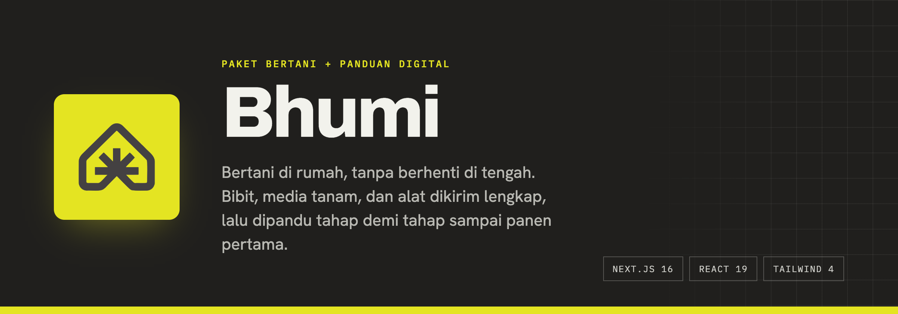
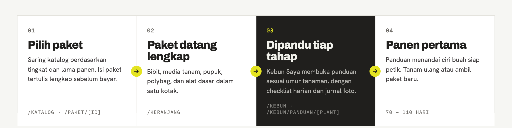
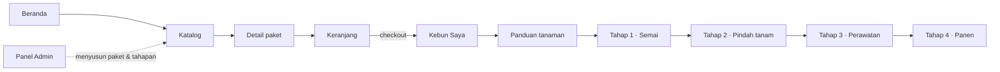
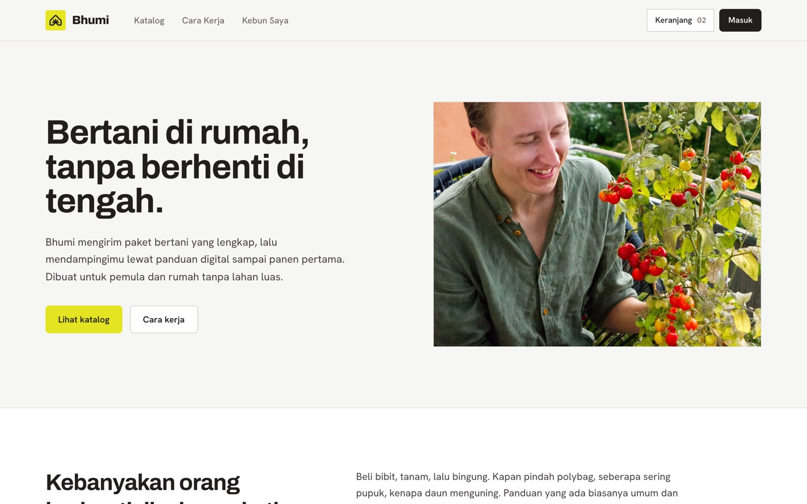
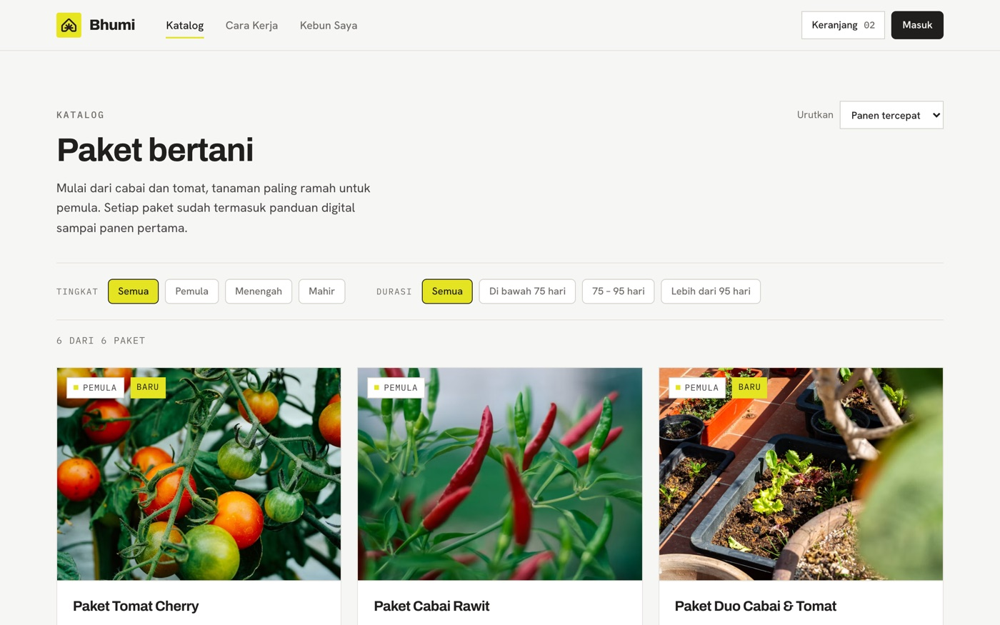
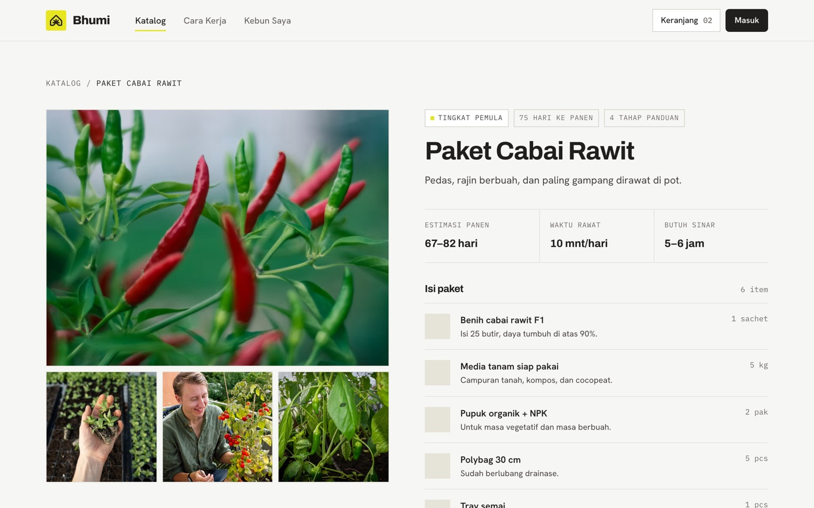
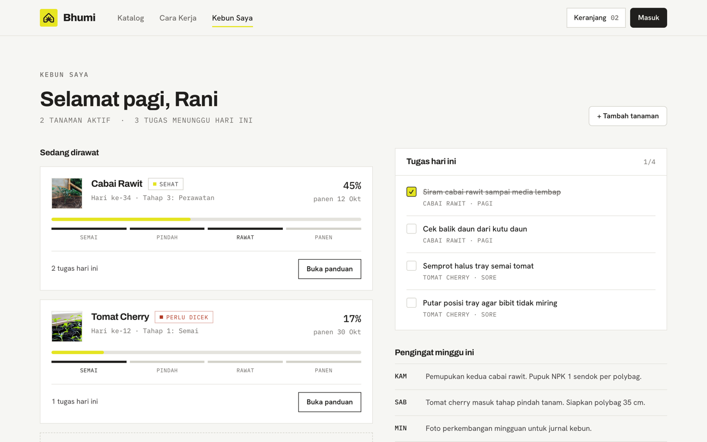
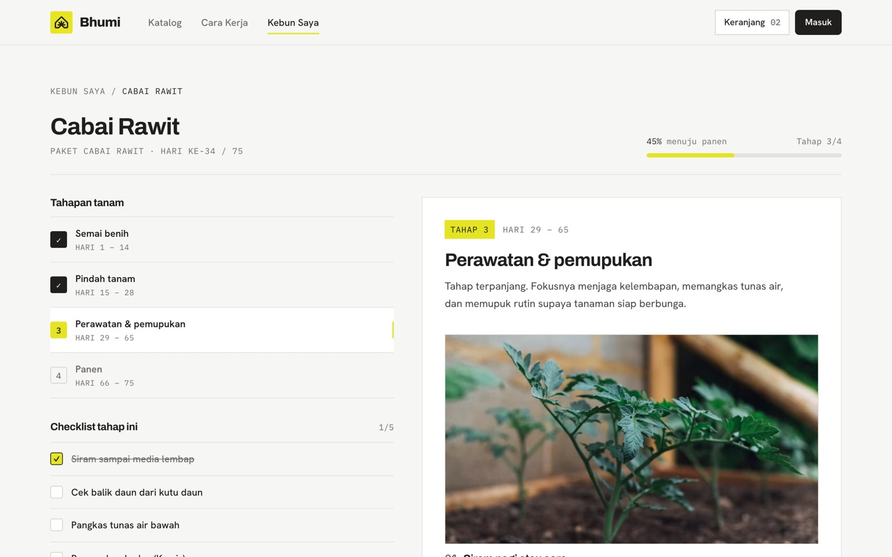
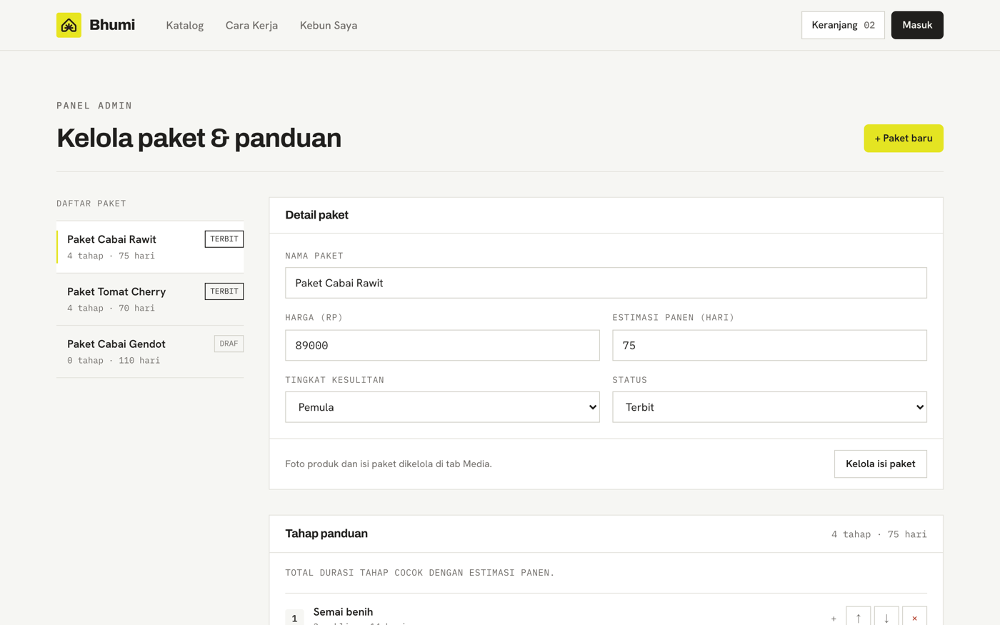
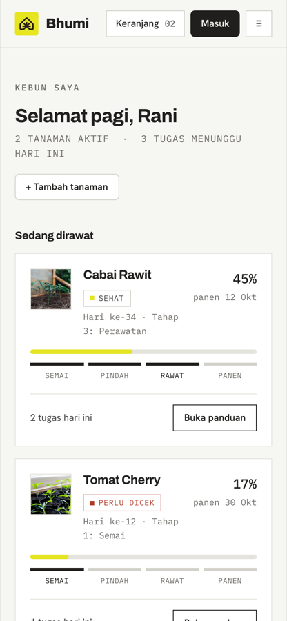

<p align="center">
  
</p>

<h1 align="center">Bhumi</h1>

<p align="center">
  <strong>Bertani di rumah, tanpa berhenti di tengah.</strong><br>
  Paket bertani lengkap yang dikirim ke rumah, dipasangkan dengan panduan digital<br>
  yang mendampingi dari semai sampai panen pertama.
</p>

<p align="center">
  <a href="#-tentang-bhumi">Tentang</a> ·
  <a href="#-fitur">Fitur</a> ·
  <a href="#-cara-kerja">Cara kerja</a> ·
  <a href="#-tampilan">Tampilan</a> ·
  <a href="#-teknologi">Teknologi</a> ·
  <a href="#-menjalankan-secara-lokal">Menjalankan</a> ·
  <a href="#-struktur-project">Struktur</a> ·
  <a href="#-status--roadmap">Roadmap</a>
</p>

<p align="center">
  
  
  
  
  
  
</p>

---

## 🌱 Tentang Bhumi

**Bhumi** (dari bahasa Sanskerta, berarti *bumi* atau *tanah*) adalah platform yang membantu orang bertani di rumah, khususnya pemula dan penghuni rumah tanpa lahan luas. Bhumi menggabungkan dua hal yang biasanya terpisah:

1. **Paket bertani fisik** — bibit, media tanam siap pakai, pupuk, polybag, dan alat dasar dalam satu kotak, takarannya sudah pas.
2. **Panduan digital** — dashboard *Kebun Saya* yang membuka instruksi tahap demi tahap sesuai umur tanaman, memberi checklist harian, dan menyimpan jurnal perkembangan.

Repository ini berisi **aplikasi web Bhumi**: etalase katalog paket, halaman detail paket, keranjang, dashboard Kebun Saya, halaman panduan per tanaman, dan panel admin untuk menyusun paket dan tahapan panduannya.

### Masalah yang diselesaikan

> Kebanyakan orang berhenti di minggu ketiga.

Beli bibit, tanam, lalu bingung. Kapan pindah polybag? Seberapa sering pupuk? Kenapa daun menguning? Panduan yang beredar biasanya umum dan tidak mengikuti kondisi tanaman yang sedang dirawat. Akhirnya tanaman terbengkalai sebelum sempat berbuah.

Bhumi menutup jarak itu. Paketnya sudah lengkap, dan dashboard memberi tahu **apa yang perlu dilakukan hari ini**, bukan sebulan lagi.

### Manfaat

| Untuk siapa | Manfaatnya |
| --- | --- |
| **Pemula** | Tidak perlu riset panjang atau belanja terpisah ke toko tani. Satu paket, satu panduan, satu tanaman sampai panen. |
| **Rumah tanpa lahan** | Semua paket dirancang untuk pot atau polybag di teras, balkon, atau pagar rumah. Cukup area yang kena matahari 5–6 jam. |
| **Yang sering gagal di tengah** | Instruksi dibuka bertahap sesuai umur tanaman, ditambah checklist dan pengingat harian, jadi tidak kewalahan dan tidak lupa. |
| **Pengelola Bhumi** | Panel admin untuk membuat paket, mengatur harga dan tingkat kesulitan, serta menyusun tahapan panduan beserta checklist-nya. |

---

## ✨ Fitur

### Sisi pembeli

- **Katalog paket** dengan filter tingkat kesulitan (Pemula / Menengah / Mahir) dan lama panen, plus pengurutan panen tercepat atau harga terendah.
- **Halaman detail paket** berisi galeri, spesifikasi (estimasi panen, waktu rawat, kebutuhan sinar), isi kit lengkap, dan pratinjau tahapan panduan.
- **Keranjang** yang tersimpan di `localStorage`, dengan subtotal dalam Rupiah.
- **Halaman Cara Kerja** dan FAQ yang menjelaskan alur dari pemesanan sampai panen.

### Kebun Saya (dashboard)

- **Ringkasan tanaman aktif**: hari ke berapa, tahap apa, persentase menuju panen, dan status kesehatan.
- **Tugas hari ini** berupa checklist (siram, cek hama, semprot tray) yang bisa dicentang.
- **Pengingat mingguan** seperti jadwal pemupukan dan pindah tanam.
- **Panduan per tanaman** yang terbagi 4–6 tahap. Tahap terbuka otomatis sesuai umur tanaman, tahap berikutnya terkunci sampai waktunya tiba.
- **Checklist per tahap**, **jurnal catatan**, dan **linimasa foto perkembangan**.

### Panel admin

- Daftar paket beserta status (Terbit / Draf) dan jumlah terjual.
- Editor paket: nama, harga, tingkat, durasi.
- Editor tahapan: judul, lama hari, media, instruksi, dan checklist per tahap.

---

## 🔁 Cara kerja

<p align="center">
  
</p>

Setiap paket yang dibeli otomatis masuk ke Kebun Saya. Dari sana pengguna menjalankan panduannya, satu tahap sekali.



Contoh tahapan untuk **Paket Cabai Rawit** (75 hari):

| Tahap | Rentang hari | Fokus |
| :-: | --- | --- |
| 1 | Hari 1 – 14 | Semai benih di tray, jaga kelembapan sampai muncul dua daun sejati |
| 2 | Hari 15 – 28 | Pindah bibit terkuat ke polybag pada sore hari |
| 3 | Hari 29 – 65 | Siram rutin, pangkas tunas air, pupuk tiap dua minggu, cek hama |
| 4 | Hari 66 – 75 | Panen bertahap tiap 3–5 hari agar tanaman terus berbuah |

---

## 🖼 Tampilan

<table>
  <tr>
    <td width="50%"><br><sub><b>Beranda</b> — nilai jual Bhumi dan masalah yang diselesaikan</sub></td>
    <td width="50%"><br><sub><b>Katalog</b> — filter tingkat dan durasi, urut berdasarkan panen atau harga</sub></td>
  </tr>
  <tr>
    <td width="50%"><br><sub><b>Detail paket</b> — spesifikasi, isi kit, dan pratinjau tahapan</sub></td>
    <td width="50%"><br><sub><b>Kebun Saya</b> — tanaman aktif, tugas hari ini, pengingat mingguan</sub></td>
  </tr>
  <tr>
    <td width="50%"><br><sub><b>Panduan tanaman</b> — tahap aktif, checklist, jurnal, dan foto perkembangan</sub></td>
    <td width="50%"><br><sub><b>Panel admin</b> — editor paket dan tahapan panduan</sub></td>
  </tr>
</table>

<p align="center">
  <br>
  <sub>Semua halaman responsif sampai layar ponsel.</sub>
</p>

> Foto produk saat ini masih placeholder dari Unsplash dan akan diganti dengan foto asli.

---

## 🛠 Teknologi

| Lapisan | Pilihan |
| --- | --- |
| Framework | [Next.js 16](https://nextjs.org) (App Router, Server Components, static generation untuk halaman paket) |
| UI | [React 19](https://react.dev) + [TypeScript 5](https://www.typescriptlang.org) |
| Styling | [Tailwind CSS 4](https://tailwindcss.com) dengan token desain kustom di `src/app/globals.css` |
| Tipografi | Archivo (display), Hanken Grotesk (teks), IBM Plex Mono (label & angka) via `next/font` |
| Gambar | `next/image` dengan remote pattern Unsplash untuk placeholder |
| State | React Context untuk keranjang, `localStorage` untuk persistensi |
| Data | Seed data statis di `src/lib/data.ts` (pengganti API sampai backend tersedia) |

### Bahasa desain

Palet diambil langsung dari logo Bhumi: **charcoal** `#201f1d` sebagai tinta dan permukaan gelap, **lime** `#e4e422` sebagai aksen tunggal, di atas latar putih tulang `#f6f6f3`. Sudut tajam, garis tipis, dan label monospace huruf besar dipakai konsisten di seluruh halaman.

---

## 🚀 Menjalankan secara lokal

### Prasyarat

- Node.js 20 atau lebih baru
- npm (atau pnpm / yarn / bun)

### Instalasi

```bash
git clone git@github.com:bintangfabian/Bhumi.git
cd Bhumi
npm install
```

### Mode pengembangan

```bash
npm run dev
```

Buka [http://localhost:3000](http://localhost:3000). Halaman akan memperbarui diri secara otomatis saat file diubah.

### Build produksi

```bash
npm run build
npm run start
```

### Skrip lain

| Perintah | Fungsi |
| --- | --- |
| `npm run lint` | Menjalankan ESLint dengan konfigurasi Next.js |

---

## 🗂 Struktur project

```
bhumi-id/
├── docs/                      # Aset README (banner, diagram, screenshot)
├── public/                    # Logo dan aset statis
└── src/
    ├── app/
    │   ├── page.tsx           # Beranda
    │   ├── katalog/           # Daftar paket + filter
    │   ├── paket/[id]/        # Detail paket (SSG per paket)
    │   ├── keranjang/         # Keranjang belanja
    │   ├── cara-kerja/        # Alur & FAQ
    │   ├── kebun/             # Dashboard Kebun Saya
    │   │   └── panduan/[plant]/   # Panduan bertahap per tanaman
    │   ├── admin/             # Panel admin paket & tahapan
    │   ├── masuk/             # Halaman login
    │   ├── layout.tsx         # Font, header, footer, CartProvider
    │   └── globals.css        # Token desain (warna, radius, tipografi)
    ├── components/
    │   ├── cart.tsx           # Context keranjang + persistensi localStorage
    │   ├── site-header.tsx    # Navigasi utama
    │   ├── site-footer.tsx
    │   ├── logo.tsx
    │   └── ui.tsx             # Button, Container, Photo, ProgressBar, dsb.
    └── lib/
        └── data.ts            # Seed data: paket, kit, tahapan, tugas, jurnal
```

### Rute

| Rute | Halaman |
| --- | --- |
| `/` | Beranda |
| `/katalog` | Katalog paket |
| `/paket/[id]` | Detail paket, contoh `/paket/cabai-rawit` |
| `/keranjang` | Keranjang |
| `/cara-kerja` | Cara kerja & FAQ |
| `/kebun` | Dashboard Kebun Saya |
| `/kebun/panduan/[plant]` | Panduan bertahap per tanaman |
| `/admin` | Panel admin |
| `/masuk` | Login |

---

## 📍 Status & roadmap

Bhumi saat ini adalah **prototipe frontend**. Seluruh tampilan dan interaksi sudah berjalan, tetapi datanya masih berasal dari seed statis di `src/lib/data.ts`. Belum ada backend, autentikasi, atau pembayaran.

- [x] Katalog, detail paket, dan keranjang
- [x] Dashboard Kebun Saya dengan tugas harian dan pengingat
- [x] Panduan bertahap dengan checklist, jurnal, dan foto perkembangan
- [x] Panel admin untuk paket dan tahapan
- [x] Desain responsif dengan identitas visual Bhumi
- [ ] Backend & database untuk paket, pengguna, dan progres tanaman
- [ ] Autentikasi pengguna dan admin
- [ ] Checkout dan integrasi pembayaran
- [ ] Unggah foto jurnal ke penyimpanan
- [ ] Notifikasi pengingat tugas harian
- [ ] Fitur tanya pendamping dari halaman tahap
- [ ] Foto produk asli menggantikan placeholder

---

## 🤝 Kontribusi

Saran dan laporan bug dipersilakan melalui *issue*. Untuk perubahan kode:

1. Fork repository ini dan buat branch baru dari `main`.
2. Jalankan `npm run lint` sebelum membuka *pull request*.
3. Jelaskan perubahan dan sertakan screenshot bila menyentuh tampilan.

---

## 📄 Lisensi

Hak cipta © Bhumi. Lisensi belum ditentukan; hubungi pemilik repository sebelum menggunakan kode ini untuk keperluan lain.
